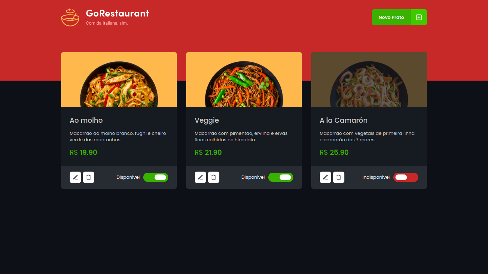

<h3 align="center">
  Challenge 04 - Class refactoring and typescript
</h3>

<p align="center">
  <a href="https://rocketseat.com.br">
    
  </a>
  
  <a href="https://github.com/luisspassos">
    
  </a>
</p>

<br>

## :rocket: About the challenge

<p align="center">
  
</p>

In this challenge, the objective is to perform two migration processes: from Javascript to Typescript and from Class Components to Function Components. 

All the files must be migrated from Javascript To Typescript. In addition, the files that possess class components must be migrated to functional components using hooks.

<br>

## :wrench: Installation and use

```bash
# Open a terminal and copy this repository with the command
git clone https://github.com/luisspassos/gorestaurant
# or use the download option.

# Enter the folder with 
cd gorestaurant

# Install the dependencies
yarn install

# Start the fake API
yarn server

# Run the development server
yarn start
```

<br>

## :memo: License

This project is under the MIT license. See the [LICENSE](/LICENSE) file for more details.

---

Made with :purple_heart: by [Luís Passos](https://github.com/luisspassos)

[](mailto:luis.passos013@gmail.com)
